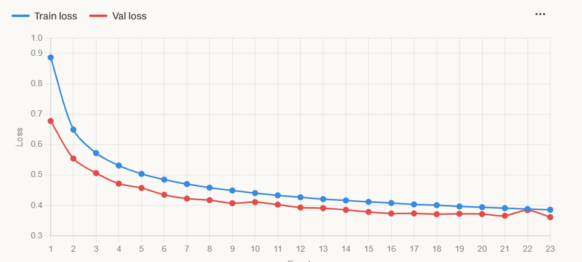

# My learning with AI experience
- Dillon Carpenter
---
# What is the Project?

- Neural Network for detecting motifs in chess positions
---
## Initial Project Setup
- WSL2
- Docker
- Devcontainer
- Pytorch
- I didn't know how to do any of this
- Thank you ChatGPT
---
### What is WSL2?
- A linux subsystem for windows
- Linux generally has a better file system than Windows
- Native CUDA support (Nvidia GPUs)
---
### What is Docker?


- Using VS Code's Dev Containers extension, docker containers can be used as development environments
- Basically, I was able to work on the project while using the container
---
```docker
# Base image
FROM pytorch/pytorch:2.2.2-cuda12.1-cudnn8-runtime

# Install Python packages
RUN pip install --no-cache-dir pandas numpy python-chess scikit-learn

COPY chess_engines/stockfish-ubuntu-x86-64-avx2 /usr/local/bin/stockfish
RUN chmod +x /usr/local/bin/stockfish
# Set default workdir (Already set in base image)
# WORKDIR /workspace
```
---
### Pytorch
- Open Source machine learning library
- Simple to use once set up
---
#### Module
- Base Class for all neural network models
- Layers like Conv2d are also Modules
---
## What is a Neural Network?
- A neural network is a machine learning model that stacks simple "neurons" in layers and learns pattern-recognizing weights and biases from data to map inputs to outputs.
---
### Types of Neural Networks
- Perceptrons (Most basic, foundational unit of a network)
- Feed Forward Networks (FNNs)
- Convolutional Networks (CNNs) (My Project)
---
### How they work


---
#### nn.Linear
- Applies a linear transformation to the incoming data
- Essentially a layer of perceptrons
- parameters:
  - in_features (int) – size of each input sample
  - out_features (int) – size of each output sample
  - bias (bool) – If set to False, the layer will not learn an additive bias.
---
### Activation Functions
- Decide how much signal the neuron sends
- Without them neural networks are basically just ax + b = y
- They introduce non-linearity by modifying the results of the linear transformation of each neuron
- This allows neural networks to approximate any complex function

---
#### nn.ReLU
- Activation function
-  f(x) = max(0,x)
-  Forces negative values to be 0 and allows positive values through
-  Common in modern networks
---
### Pytorch Example
```python
import torch.nn as nn

class SimpleNet(nn.Module):
    def __init__(self):
        super().__init__()
        self.fc1 = nn.Linear(input_size, 10)
        self.relu1 = nn.ReLU()
        self.fc2 = nn.Linear(10, 5)
        self.relu2 = nn.ReLU()

    def forward(self, x):
        x = self.fc1(x)
        x = self.relu1(x)
        x = self.fc2(x)
        x = self.relu2(x)
        return x

# Instantiate the model
model = SimpleNet()
```
---
# How was AI Used?
---
## Main Lesson Learned
- Do not have a flawed premise
- ChatGPT is quite aggreeable. If you prompt it on nonsense, it just goes with it
- In the past, was true for all LLMs (May not be the case anymore)
---
## Fancy Neural Network Stuff
---
### Residual Blocks
- Normally, the flow is x -> layer -> activation -> output
- With residual blocks, this changes to x -> -> layer -> activation -> layer + x -> activation
- Another way to think about it is this:
  - f(x) + x
---
#### Benefits?
- In forward pass (calculating the prediction), if f(x) = 0, then by directly adding the input, you basically skip the residual block.
- When adjusting weights (Backward propagation), the + x term creates a shortcut for gradients
- Much deeper neural networks can be made
---
#### Pytorch Example
```python
import torch.nn as nn
import torch.nn.functional as F

class ResBlock(nn.Module):
    def __init__(self):
        super().__init__()
        self.conv1 = nn.Conv2d(64, 64, 3, padding=1)
        self.bn1 = nn.BatchNorm2d(64)
        self.conv2 = nn.Conv2d(64, 64, 3, padding=1)
        self.bn2 = nn.BatchNorm2d(64)

    def forward(self, x):
        residual = x
        x = F.relu(self.bn1(self.conv1(x)))
        x = self.bn2(self.conv2(x))
        return F.relu(x + residual) #Very important
```
---
### Batch Normalization
- Normalizes the distribution of Batches
- During training, rather than loading all of the training data into memory, it gets seperated into batches
---
#### Benefits?
- You can use a higher learning rate
#### Caution
- Too small batch size
---
## End Result of everything I learned
