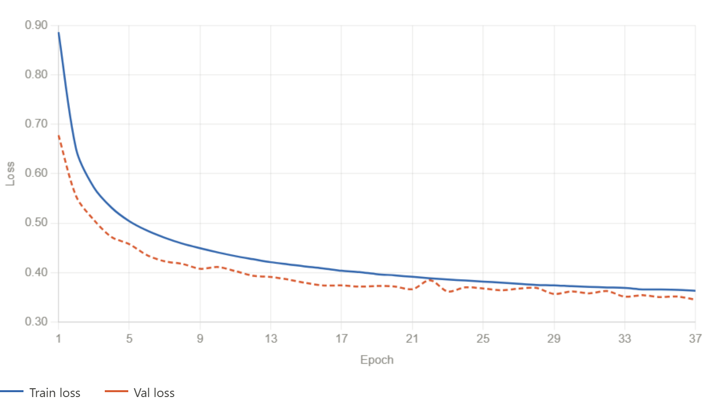
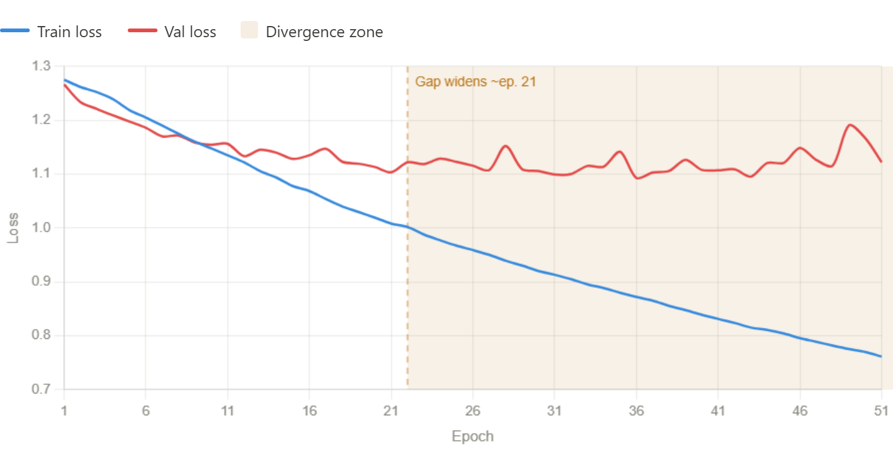

# My learning with AI experience
- Dillon Carpenter
---
## Data Visualization
---
- Most of my learning came from my Data Visualization Class
- However, I did find that Claude can make pretty good line plots
- These were very useful in diagnosing neural network models
---
## Examples
---

---
- That was the final results for my final model
  - Trained on the Entire Sample
- Its clear that the model had learned something, but now its plateuing after 12 hours of training
- This suggests potential underfitting
- Overall very healthy
---

---
- That ws the final results for my first model
- Trained on a 10k puzzle subset for quickness
- The train and validation losses diverge, with the validation loss not improving
- Clearly overfitting
- Overall, not healthy.